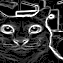
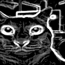
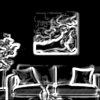
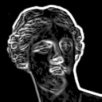
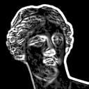
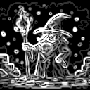
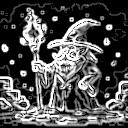

# samples/

Input images and helper scripts for the Gaussian–Sobel edge-detection MCU project.

---

## Samples — naive vs optimized

Each table shows the full pipeline for both the naive and optimized MCU builds side by side.

### sample1 — cat

| | Input | Monochrome | Gaussian blur | Sobel edge |
|---|:---:|:---:|:---:|:---:|
| **naive** |  |  |  |  |
| **opt** |  |  |  |  |

### sample2 — abstract painting

| | Input | Monochrome | Gaussian blur | Sobel edge |
|---|:---:|:---:|:---:|:---:|
| **naive** |  |  |  |  |
| **opt** |  |  |  |  |

### sample3 — sculpture

| | Input | Monochrome | Gaussian blur | Sobel edge |
|---|:---:|:---:|:---:|:---:|
| **naive** |  |  |  |  |
| **opt** |  |  |  |  |

### sample4 — pixel art

| | Input | Monochrome | Gaussian blur | Sobel edge |
|---|:---:|:---:|:---:|:---:|
| **naive** |  |  |  |  |
| **opt** |  |  |  |  |

### sample5 — portrait

| | Input | Monochrome | Gaussian blur | Sobel edge |
|---|:---:|:---:|:---:|:---:|
| **naive** |  |  |  |  |
| **opt** |  |  |  |  |

---

## Scripts

### `prepare_input.py` — image → C headers

Converts a BMP/PNG into `input.h` (and optionally the three reference output
headers) written to `proj_cm55/`.

```
python3 prepare_input.py <image> [--width W] [--height H] [--crop] [--no-refs]
```

| flag | meaning |
|------|---------|
| `--width / --height` | resize the image before encoding |
| `--crop` | center-crop to target aspect ratio before resizing |
| `--no-refs` | emit only `input.h`, skip the three `out_*.h` reference headers |

> After changing dimensions, update `HEIGHT`/`WIDTH` in `proj_cm55/core_shared.h`.

**Examples**

```bash
# 320×240 native resolution, full reference headers
python3 prepare_input.py sample5/sample.bmp

# resize to 128×128, skip reference headers (generate them from the MCU later)
python3 prepare_input.py sample5/sample.bmp --width 128 --height 128 --no-refs
```

---

### `dump_to_headers.py` — naive serial log → reference C headers

Parses `===BEGIN/END===` hex blocks from a captured naive-build UART log and
writes `out_monochrome.h`, `out_gaussian_blur.h`, `out_sobel_edge.h` to
`proj_cm55/`.  Use this instead of `prepare_input.py` refs when you want the
MCU's own naive output as the ground truth (avoids host/MCU float-ordering
noise).

```
python3 dump_to_headers.py <log> --width W --height H
```

**Example**

```bash
python3 dump_to_headers.py sample5/naive.log --width 128 --height 128
```

---

### `dump_to_image.py` — serial log → grayscale BMP files

Parses the same hex blocks and saves each one as an 8-bit grayscale BMP.
Pure stdlib, no Pillow required.

```
python3 dump_to_image.py <log> [--width W] [--out-dir DIR] [--prefix PREFIX]
```

**Examples**

```bash
# naive build output
python3 dump_to_image.py sample5/naive.log --width 128 --out-dir sample5/naive

# optimized build output
python3 dump_to_image.py sample5/opt.log --width 128 --out-dir sample5/opt
```

---

## Typical workflow (128×128, sample5)

Open three terminals.

**t1** — build & flash

```bash
# 1. flash naive core to measure baseline
#    set core_naive in main.c
make program

# 4. flash optimized core to compare
#    set core in main.c
make program
```

**t2** — serial monitor

```bash
cd ../sample5

# 2. capture naive run
picocom --logfile naive.log /dev/ttyACM0 -b 115200

# 5. capture optimized run
picocom --logfile opt.log /dev/ttyACM0 -b 115200
```

**t3** — host scripts

```bash
# 3. prepare input headers (no refs — will use naive MCU output as ground truth)
python3 prepare_input.py sample5/sample.bmp --no-refs

# after naive run: extract reference headers + visualize naive output
python3 dump_to_headers.py sample5/naive.log --width 128 --height 128
python3 dump_to_image.py sample5/naive.log --width 128 --out-dir sample5/naive

# after optimized run: visualize optimized output
python3 dump_to_image.py sample5/opt.log --width 128 --out-dir sample5/opt
```

---

## Sample directories

Each `sampleN/` folder contains a source image (`sample.bmp`) and, after
running the scripts, subdirectories `naive/` and `opt/` with the resulting
BMP outputs.

```
samples/
├── sample1/ … sample5/
│   ├── sample.bmp
│   ├── naive.log          # captured after naive flash
│   ├── opt.log            # captured after optimized flash
│   ├── naive/             # BMPs from dump_to_image (naive)
│   └── opt/               # BMPs from dump_to_image (optimized)
├── 320x240/               # full-resolution reference images
├── prepare_input.py
├── dump_to_headers.py
└── dump_to_image.py
```

**Requirements:** `Pillow`, `numpy` (for `prepare_input.py` only).
